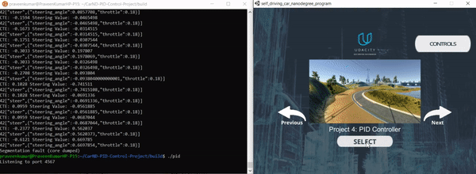

# CarND-Controls-PID
Self-Driving Car Engineer Nanodegree Program

---

## Dependencies

* cmake >= 3.5
 * All OSes: [click here for installation instructions](https://cmake.org/install/)
* make >= 4.1(mac, linux), 3.81(Windows)
  * Linux: make is installed by default on most Linux distros
  * Mac: [install Xcode command line tools to get make](https://developer.apple.com/xcode/features/)
  * Windows: [Click here for installation instructions](http://gnuwin32.sourceforge.net/packages/make.htm)
* gcc/g++ >= 5.4
  * Linux: gcc / g++ is installed by default on most Linux distros
  * Mac: same deal as make - [install Xcode command line tools]((https://developer.apple.com/xcode/features/)
  * Windows: recommend using [MinGW](http://www.mingw.org/)
* [uWebSockets](https://github.com/uWebSockets/uWebSockets)
  * Run either `./install-mac.sh` or `./install-ubuntu.sh`.
  * If you install from source, checkout to commit `e94b6e1`, i.e.
    ```
    git clone https://github.com/uWebSockets/uWebSockets 
    cd uWebSockets
    git checkout e94b6e1
    ```
    Some function signatures have changed in v0.14.x. See [this PR](https://github.com/udacity/CarND-MPC-Project/pull/3) for more details.
* Simulator. You can download these from the [project intro page](https://github.com/udacity/self-driving-car-sim/releases) in the classroom.

Fellow students have put together a guide to Windows set-up for the project [here](https://s3-us-west-1.amazonaws.com/udacity-selfdrivingcar/files/Kidnapped_Vehicle_Windows_Setup.pdf) if the environment you have set up for the Sensor Fusion projects does not work for this project. There's also an experimental patch for windows in this [PR](https://github.com/udacity/CarND-PID-Control-Project/pull/3).

## Basic Build Instructions

1. Clone this repo.
2. Make a build directory: `mkdir build && cd build`
3. Compile: `cmake .. && make`
4. Run it: `./pid`. 

Tips for setting up your environment can be found [here](https://classroom.udacity.com/nanodegrees/nd013/parts/40f38239-66b6-46ec-ae68-03afd8a601c8/modules/0949fca6-b379-42af-a919-ee50aa304e6a/lessons/f758c44c-5e40-4e01-93b5-1a82aa4e044f/concepts/23d376c7-0195-4276-bdf0-e02f1f3c665d)

## Editor Settings

We've purposefully kept editor configuration files out of this repo in order to
keep it as simple and environment agnostic as possible. However, we recommend
using the following settings:

* indent using spaces
* set tab width to 2 spaces (keeps the matrices in source code aligned)

## Code Style

Please (do your best to) stick to [Google's C++ style guide](https://google.github.io/styleguide/cppguide.html).

## Project Instructions and Rubric

Note: regardless of the changes you make, your project must be buildable using
cmake and make!

More information is only accessible by people who are already enrolled in Term 2
of CarND. If you are enrolled, see [the project page](https://classroom.udacity.com/nanodegrees/nd013/parts/40f38239-66b6-46ec-ae68-03afd8a601c8/modules/f1820894-8322-4bb3-81aa-b26b3c6dcbaf/lessons/e8235395-22dd-4b87-88e0-d108c5e5bbf4/concepts/6a4d8d42-6a04-4aa6-b284-1697c0fd6562)
for instructions and the project rubric.


<br/><br/>
<h1 align="center"> Addressing Project Rubric </h1>

[](http://www.udacity.com/drive)
<h2 align="center">Compilation </h2>

<em>Code is compiling without errors with cmake and make</em>

<h2 align="center">Implementation </h2>

<em>Base algorithm follows what's presented in the lessor. hyperparameter tuning/optimization is done manually.</em>

<h2 align="center">Reflection </h2>
<br/><br/>

<em>Describe the effect each of the P, I, D components had in your implementation.</em>

A proportional–integral–derivative controller (PID controller or three-term controller) is a control loop mechanism employing feedback that is widely used in industrial control systems and a variety of other applications requiring continuously modulated control. A PID controller continuously calculates an error value e(t) as the difference between a desired setpoint (SP) and a measured process variable (PV) and applies a correction based on proportional, integral, and derivative terms (denoted P, I, and D respectively), hence the name. <== **From Wikipedia**


**Proportional**

The obvious method is proportional control: control input will be set in proportion to the existing cross track error. However, this method is unstable if the proportional gain is too high.

**Integral**

An integral term increases action in relation not only to the error but also the time for which it has persisted. Thus it is very effective in eleminating the systematic bias as explained in the lecture.

**Derivative**

A derivative term does not consider the error (meaning it cannot bring it to zero), but the rate of change of error, trying to bring this rate to zero. It aims at flattening the error trajectory into a horizontal line, thus reducing the overshoot(incase of the simulator not going off the track).

<br/><br/>

<em>Describe how the final hyperparameters were chosen.</em>

Parameters are chosen in trial and error method by the intuitive understanding of the usage of different parameter values.

Initial values for the gains are set by the intuitive values from the PID implementation lecture from sebastian. Those values are then tuned to give the desired performance for the given problem in the simulator environment.

Then it was changed continuously upto the point where the car can finish a lap successfully and safely.

Among many iterations experimented, four combination values are given below.

| kp  | ki | kd  | Result |
| ------------- | ------------- | ------------- | ------------- |
| 0.1  | 0.001  | 1.8  | Fail  |
| 0.15  | 0.001  | 1.8  | Fail  |
| 0.12  | 0.001  | 1.8  | Fail  |
| 0.09  | 0.001  | 1.8  | Pass  |

`Note that I've modified the throttle value between 0.18 ~ 0.3 for the above combinations and finally set it to constant value of `0.18` to make it stable.`


<h2 align="center">Simulation </h2>

<em>The vehicle successfully drives a lap around the track.</em>

[Simulation video](./results/PID_Final_Result.mp4) is recorded and attached in the results directory. '.gif' file is shown below.



